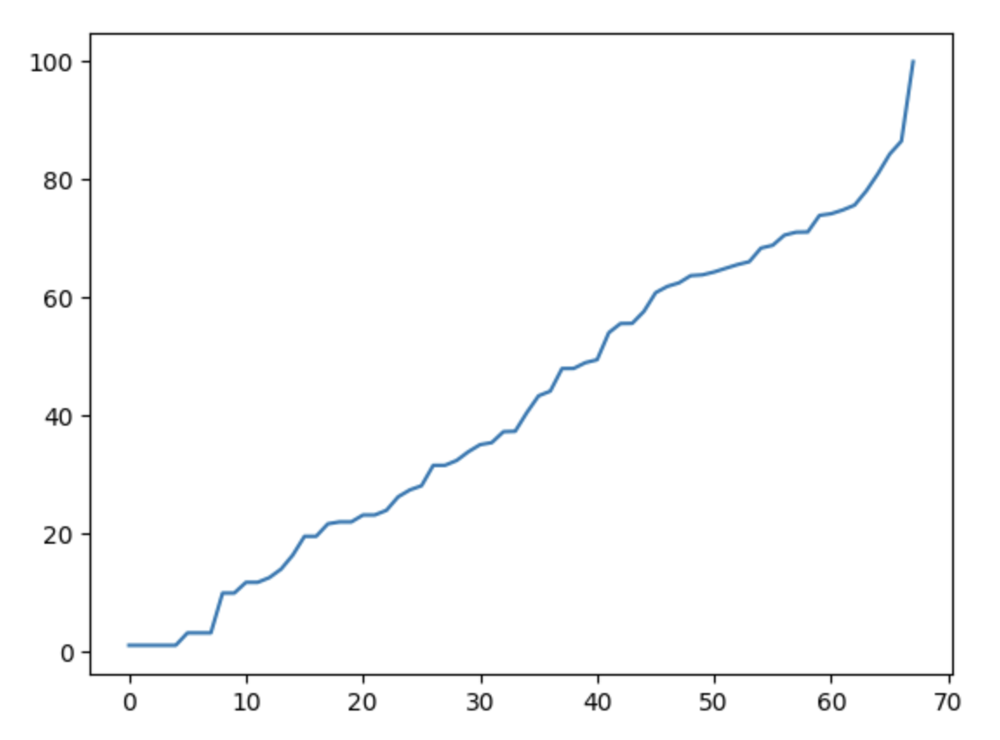

# Visualization - Country Ranking 

The Project ranked **68 countries** based on their contribution to **Computer Security and Cryptography**.

## Methodology

### 1. Data Collection

Based on the [computer security conference ranking](https://people.engr.tamu.edu/guofei/sec_conf_stat.htm) created by **Guofei Gu**, I collected the around **23600** papers from **DBLP** and separated the data to three level of importance.

Tier1 Conference: 6807 papers

Tier2 Conference: 7798 papers

Tier3 Conference: 9054 papers

Those papers are written by around 4000 institutions including schools and companies. (Published after 1990)


Details are structured below:

1. Open [qlever](https://qlever.cs.uni-freiburg.de/dblp), a tool for query dataset from DBLP

2. Prepare (Manually) the fields name for each conference in DBLP (The result is in `venue_keyword.txt`)

3. Use the below query to obtain data (Example for conference `IEEE Symposium on Security and Privacy`). (The result is in `./OriginalData/`)

   ```sql
   PREFIX dblps: <https://dblp.org/rdf/schema-2020-07-01#>
   PREFIX dblp: <https://dblp.org/rdf/schema#>
   SELECT ?paper ?affiliation WHERE {
     ?paper dblp:publishedIn "IEEE Symposium on Security and Privacy" .
     ?paper dblp:yearOfPublication ?year.
     ?paper dblp:authoredBy ?authoredby .
     ?authoredby dblp:affiliation ?affiliation .
     FILTER (?year >= "1990")
   }
   ORDER BY DESC(?year)
   ```

   

### 2. Data Cleanning

The data is messy, but there's some methods can be applied to decrease the time for manually cleaning (Make it doable at least). Anyway, a cleaned data are uploaded:

`countries2institution.txt`: A mapping structure from country to its institutions

`institution2countries.txt`: A mapping structure from institution to its home country


### 3. Compute the Grade

* For one paper in Tier1, 1.5 points is given to the writers' countries
* For one paper in Tier2, 1.25 points is given to the writers' countries
* For one paper in Tier3, 1 point is given to the writers' countries

* If a paper is written by many authors from different countries, each country will be given the same grade. For example,
  * {author from China, author from China, author from China}, Tier1 => China gets 1.5 points for this paper
  * {author from China, author from China, author from Canada}, Tier3 => China gets 1point, Canada gets 1 point


Here's some sample of the computed grade.

```python
'United States of America': 15644.36
'China': 3445.61,
'Germany': 4260.11,
'Brazil': 476.86,
'Spain': 471.11,
'Canada': 1263.11,
'Kuwait': 3.11
```

For visualization purpose. we want them to be better distributed in the color map as well as keeping the ranking order. We do the following adjustment to the grade. (The result is saved in `grade.txt`)

```
1. For each grade, take the log of it.
2. Take the grade of "United States of Ameriaca" as base grade.
3. For each grade, divides by the base grade
```

The grade distribution now looks like this:



### 4.  Visualization on maps

* Visualization relies on library `Geopandas`
* GUI relies on library `Gooey`
* Manually added country `Singapore`, `Malta` (They are too small, not in the build-in map). So, the size, and shape of these two countries are not correct.


## How to Run the Code?

